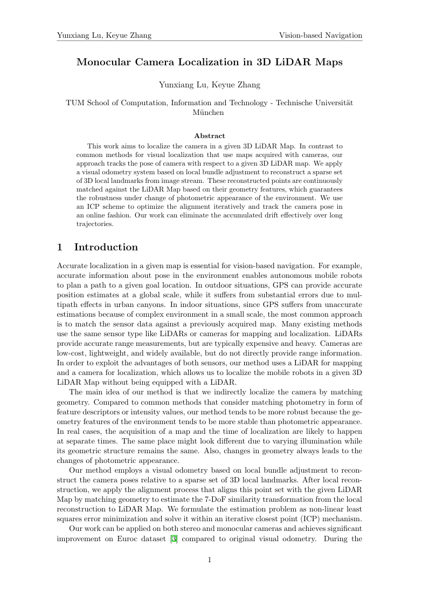
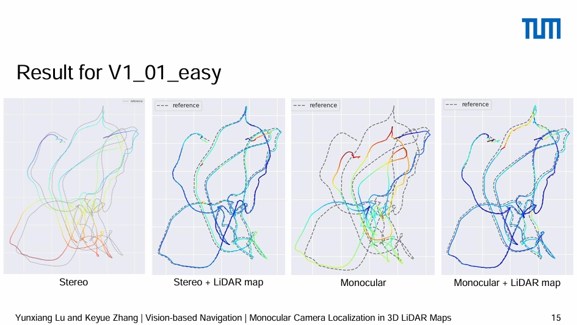

# Monocular Camera Localization in 3D LiDAR Map

## Project Files
This is the project folder for Monocular Camera Localization in 3D LiDAR Map.

The codes are not open-sourced by now.

### Project Techinical Report
The report can be found in [Report.pdf](./Report_Monocular_Camera_Localization_in_3D_LiDAR_Maps.pdf)

### Project Presentation
The presentation can be found in [SLAM-pre.pdf](./SLAM-pre.pdf). You can also download PPT version [SLAM-pre.pptx](./SLAM-pre.pptx) (containing demo videos)

