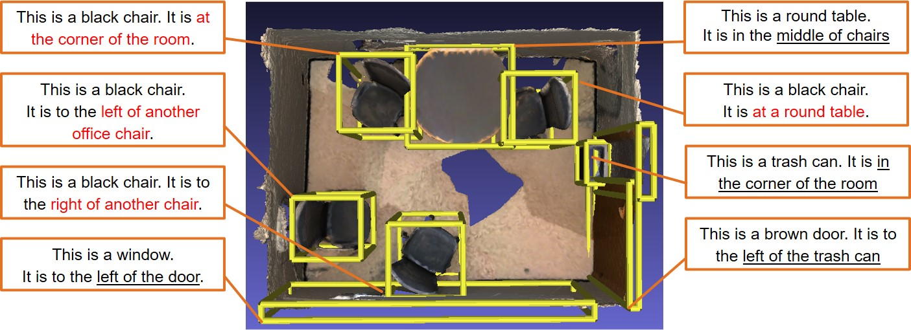
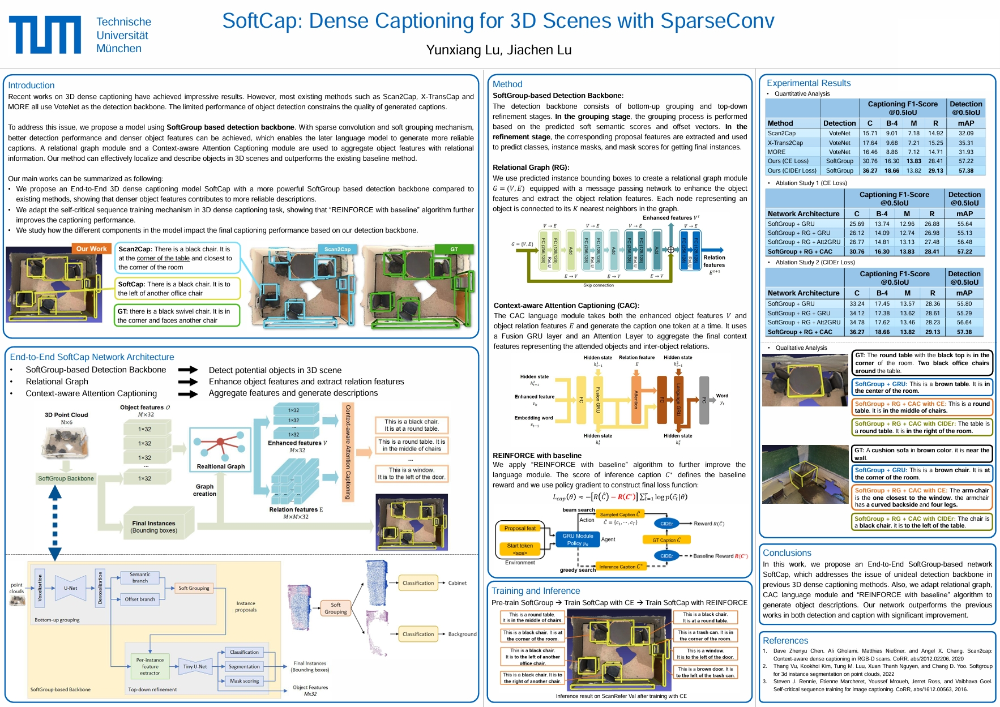
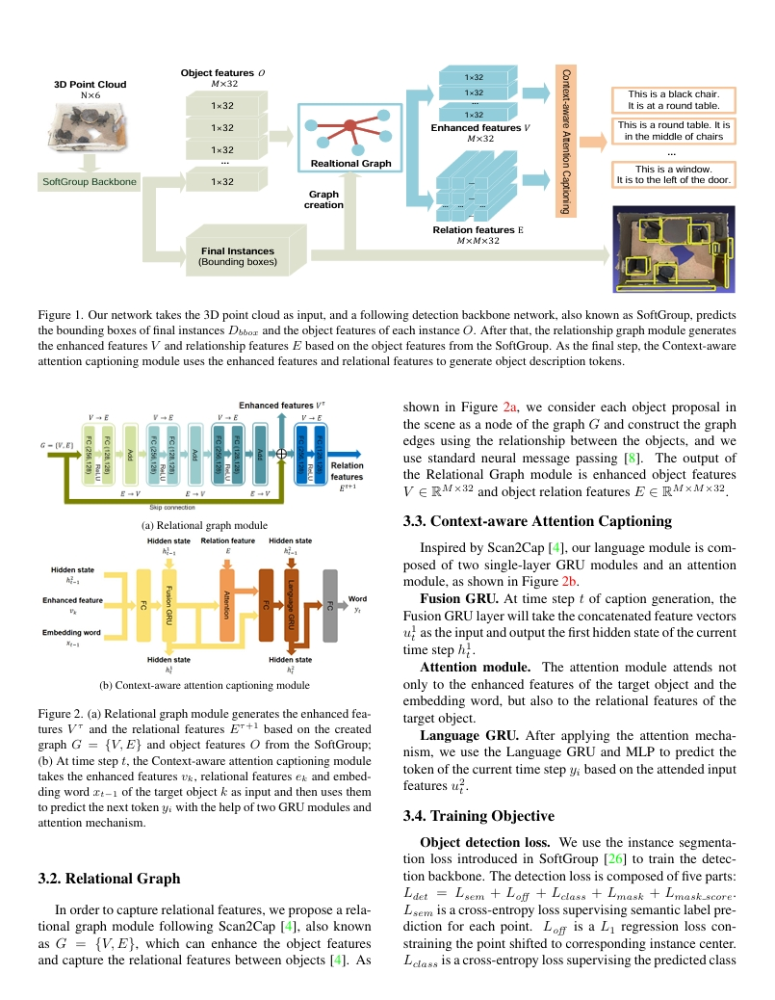
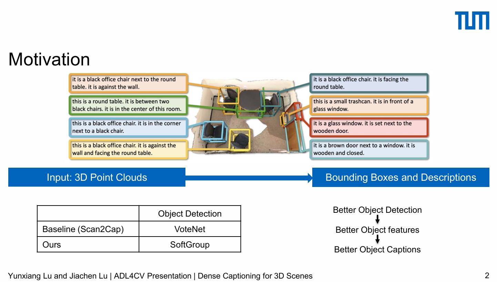
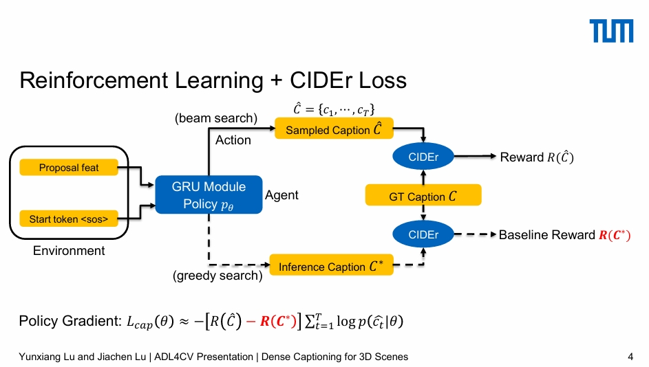

# SoftCap: Dense Captioning for 3D Scenes with SparseConv

## Project Files
This is the project folder for SoftCap.
Due to historical reasons, All the codes can be found in repository: https://github.com/LuckyMax0722/SoftCap/tree/master

### Projcet Poster
The poster can be found in [Poster.pdf](./Poster.pdf)

### Project Techinical Report
The report can be found in [Dense_Captioning_Report_Yunxiang_Jiachen.pdf](./Dense_Captioning_Report_Yunxiang_Jiachen.pdf)

### Project Presentation
The first presentation can be found in [SoftCap_Pre_1.pdf](./SoftCap_Pre_1.pdf)

The second presentation can be found in [SoftCap_Pre_2.pdf](./SoftCap_Pre_2.pdf)

## Introduction
We propose a model using SoftGroup based detection backbone. With sparse convolution and soft grouping mechanism, 
better detection performance and denser object features can be achieved, which enables the later language model to 
generate more reliable captions. A message passing graph model and an attention mechanism are used to aggregate object 
features with relational information. Our method can effectively localize and describe objects in 3D scenes and 
outperforms the existing baseline method with a significant improvement.

## Results
Quantitative results of 3D dense captioning on ScanRefer. All metrics are thresholded by IoU 0.5. Our method outperforms 
all baselines with a remarkable margin.

| Method      | Detection |   CIDEr   | BLEU-4 | METEOR | ROUGE | Detection mAP |
|:------------|:---------|:---------:|:------:|:------:|:-----:|:-------------------:|
| Scan2Cap    |  VoteNet  |   15.71   |  9.01  |  7.18  | 14.92 | 32.09             |
| X-Trans2Cap |  VoteNet  |   17.64   |  9.68  |  7.21  | 15.25 | 35.31             |
| More        |  VoteNet  |   16.46   |  8.86  |  7.12  | 14.71 | 31.93             |
| Ours(CE)    | SoftGroup |   30.76   | 16.30  | **13.83**  | 28.41 | 57.22             |
| **Ours(CIDEr)** |        **SoftGroup**   | **36.27** | **18.66**  | 13.82  | **29.13** | **57.38**             |
